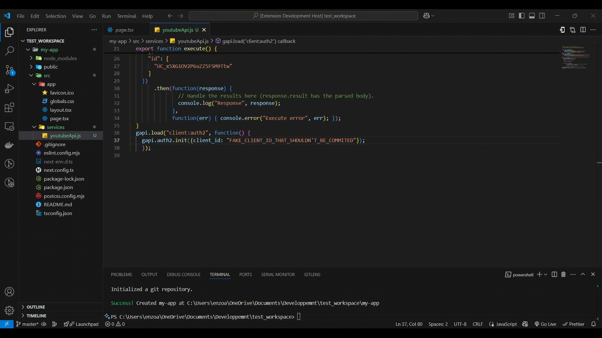
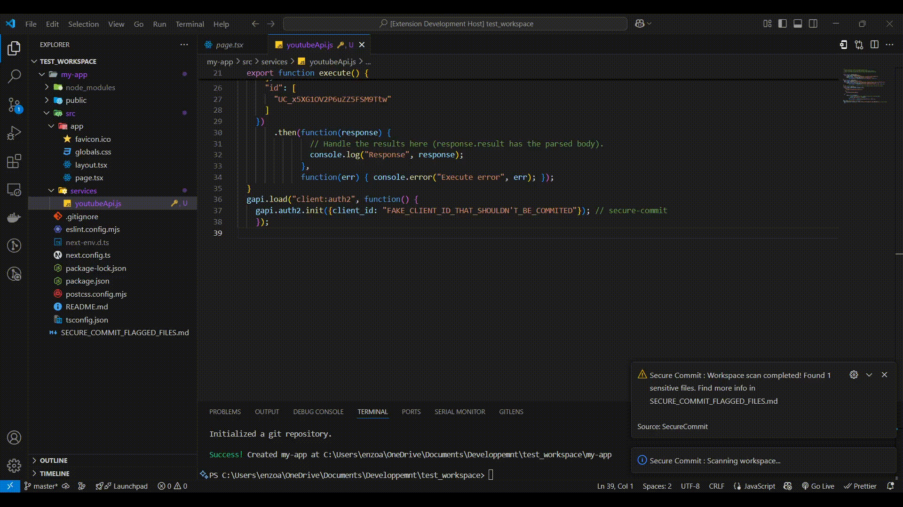

# SecureCommit

SecureCommit is an extension that helps you avoid letting sensitive info appearing in your commits. Wether you're a beginner or an experienced programmer, I hope this extension will help you not letting any sensitive info be commited.

## Features

### Write a simple comment

Start by writing a simple comment or text next to the line containing the sensitive info you don't want to appear in your next commit.

### Run `Scan Workspace` command

Once you're done writing your code, before you commit your changes, quickly run the `Scan Workspace` command to find any secrets that shouldn't appear in your commit.

### Open the generated file

If any `secure-commit` text/comment is found anywhere in the workspace, the files containing the text/comment will be added to a generated file `SECURE_COMMIT_FLAGGED_FILES.md`

> Tip: Adding a file or folder to a `.gitignore` file will prevent the said file/folder to be flagged by the `Scan Workspace` command.

## Extension commands

`Scan Workspace` : Scans the current workspace to find any file containing secrets and generates a markdown file listing all files and folders containing sensitive info.

`Version` : Opens an information message displaying the current version of Secure Commit.

## Known Issues

Flagged files should appear purple in the view but the color doesn't change.

> If you run into any problem using Secure Commit, feel free to send me an email or open an issue on the public repository.

## Release Notes

### 1.0.2

Added a description. More info can be found in `CHANGELOG.md`

---

## Useful links

[GitHub Repository](https://github.com/Enzoait/SecureCommit)

[Open an issue](https://github.com/Enzoait/SecureCommit/issues/new)

[My Linked-In](https://www.linkedin.com/in/enzo-ait-yakoub-a19254231/)

[Contact me](mailto:enzo.aityakoub@gmail.com)